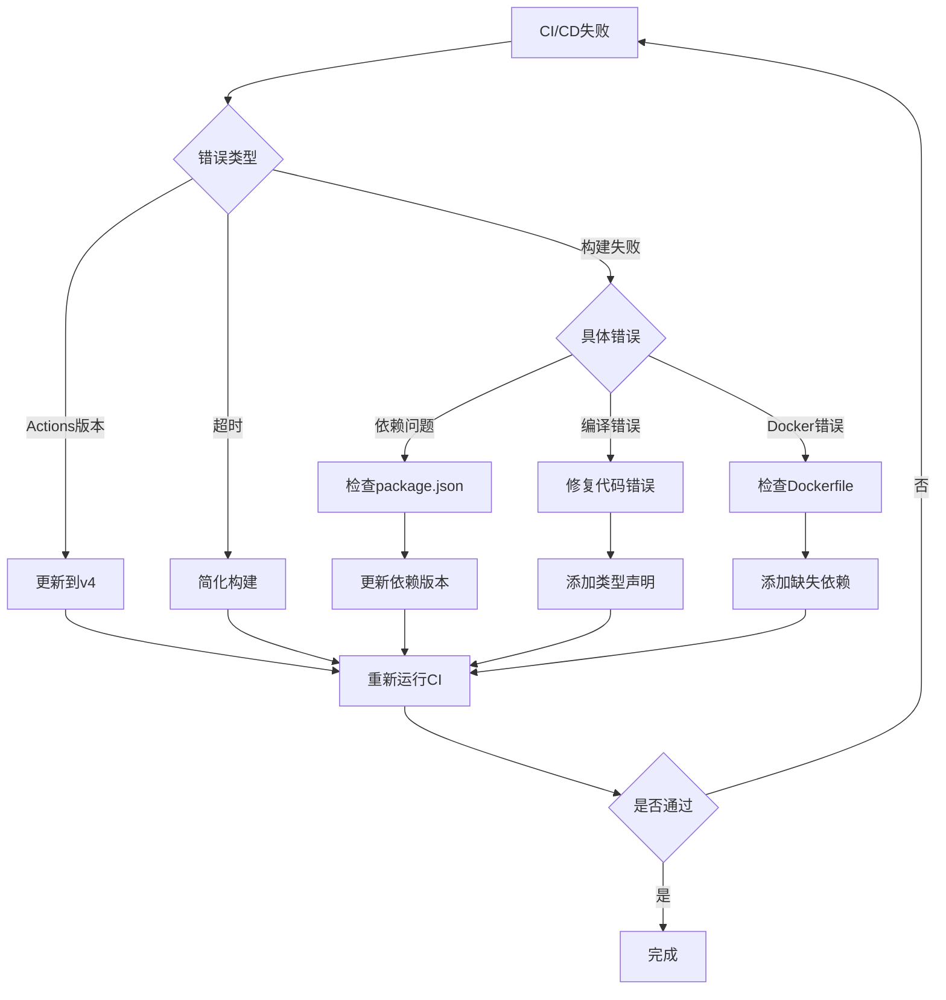

# MVP开发提示词模板 - 基于tldraw协作画布项目实践

## 一、完整MVP开发提示词模板

### 基础版提示词
```
创建一个基于[核心技术栈]的MVP应用，包含以下功能：

## 核心要求
1. **技术栈**：[列出主要技术，如: Next.js 14, React 18, TypeScript, Tailwind CSS]
2. **核心功能**：
   - [功能1：如实时协作]
   - [功能2：如无限画布]
   - [功能3：如自定义组件]
3. **部署要求**：
   - 本地部署验证
   - Docker容器化
   - CI/CD自动化

## 项目结构
使用monorepo结构，包含：
- apps/web (前端应用)
- apps/server (后端服务)
- 共享配置和依赖

## 交付标准
1. 完整的代码实现
2. Docker部署方案
3. GitHub Actions CI/CD
4. 部署验证报告
```

### 进阶版提示词（包含具体实现细节）
```
创建MVP：基于tldraw的实时协作画布系统

## 详细需求

### 1. 技术架构
**前端技术栈**：
- Next.js 14 (App Router)
- React 18 + TypeScript
- Tailwind CSS
- tldraw v2 (画布引擎)
- @tldraw/sync (实时同步)

**后端技术栈**：
- Node.js + Express
- Socket.IO (WebSocket)
- Hocuspocus (Yjs服务器)
- node-pty (终端模拟)

### 2. 功能模块
1. **无限画布** (基于tldraw v2)
   - 支持绘图、文本、形状等基础功能
   - 自定义工具和UI组件
   - 响应式适配

2. **实时协作**
   - 基于房间的协作系统
   - URL参数控制房间ID
   - WebSocket实时同步
   - 用户光标和选择同步

3. **自定义嵌入组件**
   - 3D模型查看器 (@google/model-viewer)
   - Web终端 (xterm.js + node-pty)
   - 协作文档编辑器 (Tiptap + Yjs)

### 3. 部署要求
1. **本地开发**
   - pnpm workspace管理
   - 开发服务器热更新
   - 环境变量配置

2. **Docker部署**
   - 多阶段构建优化
   - docker-compose编排
   - 健康检查配置

3. **CI/CD流程**
   - GitHub Actions自动化
   - 多平台镜像构建
   - 推送到GitHub Container Registry

### 4. 项目结构
```
project/
├── apps/
│   ├── web/          # Next.js前端
│   └── server/       # Node.js后端
├── docker/
│   └── docker-compose.yml
├── .github/
│   └── workflows/
│       ├── ci.yml
│       └── docker-build.yml
├── Dockerfile
├── package.json
└── pnpm-workspace.yaml
```

### 5. 交付标准
- [ ] 所有功能代码实现
- [ ] 本地运行验证通过
- [ ] Docker镜像构建成功
- [ ] CI/CD全部通过
- [ ] 部署文档完整
```

## 二、常见错误及解决方案提示词

### 1. GitHub Actions错误修复
```
修复GitHub Actions CI/CD错误：

错误类型：deprecated actions版本
解决方案：
1. 将所有actions/*@v3更新为@v4
2. 检查并更新：
   - actions/checkout@v4
   - actions/setup-node@v4
   - actions/cache@v4
   - actions/upload-artifact@v4
```

### 2. Docker构建错误修复
```
修复Docker构建错误：

错误：node-pty编译失败 - ModuleNotFoundError: No module named 'distutils'
解决方案：
在Dockerfile中添加Python依赖：
RUN apk add --no-cache python3 py3-setuptools python3-dev make g++ bash

错误：多平台构建超时
解决方案：
1. 简化为单平台：platforms: linux/amd64
2. 移除不必要的构建步骤
3. 使用构建缓存
```

### 3. TypeScript/CSS导入错误
```
修复TypeScript CSS模块导入错误：

错误：Cannot find module 'xterm/css/xterm.css'
解决方案：
1. 创建类型声明文件 src/types/css.d.ts：
   declare module '*.css' {
     const content: any
     export default content
   }
2. 分离CSS导入到Promise中：
   import('xterm/css/xterm.css').catch(() => {})
```

## 三、CI/CD优化提示词模板

### 基础CI配置
```
创建GitHub Actions CI/CD配置，要求：

1. **CI Pipeline** (.github/workflows/ci.yml)
   - Node.js 20.x环境
   - pnpm包管理器
   - 代码检查和构建测试
   - 错误容忍机制（continue-on-error）

2. **Docker构建** (.github/workflows/docker-build.yml)
   - 构建并推送到ghcr.io
   - 支持分支和标签触发
   - 使用GitHub Container Registry
   - 构建缓存优化

3. **优化策略**
   - 单平台构建减少超时
   - 并行任务执行
   - 依赖缓存复用
   - 跳过非关键检查
```

### CI错误诊断提示词
```
诊断并修复CI/CD失败：

1. 获取错误信息：
   - 使用GitHub API获取workflow运行状态
   - 检查具体失败的job和step
   - 分析错误日志

2. 常见修复策略：
   - 简化构建流程
   - 添加错误重试机制
   - 使用continue-on-error
   - 调整超时设置

3. 验证修复：
   - 提交修复代码
   - 监控新的CI运行
   - 确认所有检查通过
```

## 四、完整开发流程提示词

### 阶段1：项目初始化
```
初始化MVP项目：
1. 创建monorepo结构
2. 配置pnpm workspace
3. 安装核心依赖
4. 设置TypeScript和构建配置
```

### 阶段2：功能实现
```
实现核心功能：
1. 创建基础组件结构
2. 实现主要功能模块
3. 添加实时协作支持
4. 集成第三方服务
```

### 阶段3：本地验证
```
本地部署验证：
1. 启动开发服务器
2. 测试所有功能
3. 生成验证报告
4. 修复发现的问题
```

### 阶段4：容器化
```
Docker容器化：
1. 创建多阶段Dockerfile
2. 配置docker-compose
3. 添加健康检查
4. 测试容器运行
```

### 阶段5：CI/CD配置
```
配置自动化流程：
1. 创建GitHub Actions workflows
2. 配置镜像构建和推送
3. 添加自动化测试
4. 设置部署通知
```

### 阶段6：问题修复
```
修复CI/CD问题：
1. 监控workflow运行状态
2. 分析错误日志
3. 应用修复方案
4. 验证修复效果
```

## 五、最佳实践提示词

### 错误处理策略
```
实施稳健的错误处理：
1. 使用try-catch包裹关键代码
2. 添加适当的错误日志
3. 实现优雅降级
4. 提供用户友好的错误提示
```

### 性能优化
```
优化MVP性能：
1. 代码分割和懒加载
2. 图片和资源优化
3. 缓存策略实施
4. 构建体积优化
```

### 安全性考虑
```
确保MVP安全性：
1. 环境变量管理
2. 敏感信息保护
3. 输入验证和消毒
4. CORS配置
```

## 六、故障排查决策树



## 七、快速修复命令集

### Git操作
```bash
# 提交CI修复
git add -A && git commit -m "fix: 修复CI/CD构建错误"

# 使用token推送
git remote set-url origin https://[TOKEN]@github.com/[USER]/[REPO].git
git push origin [BRANCH]
```

### Docker操作
```bash
# 本地测试构建
docker build -t test:latest .

# 运行并验证
docker run -d --name test -p 3000:3000 test:latest
docker logs test
```

### CI状态检查
```bash
# 使用GitHub API检查状态
curl -H "Authorization: token [TOKEN]" \
  "https://api.github.com/repos/[USER]/[REPO]/actions/runs"
```

## 八、提示词使用建议

1. **明确需求**：开始时就详细说明技术栈和功能要求
2. **分步执行**：将大任务分解为可管理的小步骤
3. **快速迭代**：遇到错误立即修复，不要累积问题
4. **监控反馈**：持续检查CI/CD状态，及时调整
5. **文档记录**：记录所有修改和解决方案供后续参考

## 总结

这个模板基于实际的tldraw协作画布MVP项目开发经验，涵盖了从项目初始化到CI/CD配置的完整流程。使用这些提示词模板可以：

- 快速启动新的MVP项目
- 系统性地解决常见问题
- 建立可靠的自动化流程
- 确保项目质量和可维护性

记住：**简单可靠优于复杂完美**，特别是在MVP阶段。