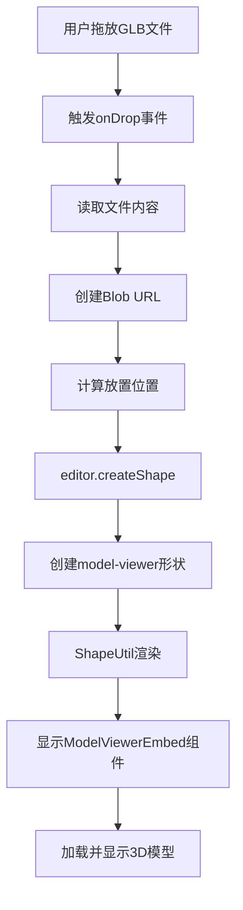

# tldraw嵌入原理及实现方案

## 问题诊断

### 当前问题
GLB文件拖入页面没有反应的原因：
1. **TldrawBoard组件未注册自定义形状处理器**
2. **没有实现拖放事件监听**
3. **ModelViewerEmbed组件未与tldraw集成**
4. **缺少文件类型识别和处理逻辑**

### 现有代码分析
```typescript
// 当前TldrawBoard只有基础配置
<Tldraw
  onMount={handleMount}
  persistenceKey={`board-${roomId}`}
/>
// 缺少: shapeUtils, tools, components, onDrop等配置
```

## tldraw嵌入原理

### 1. 形状系统 (Shape System)
tldraw使用形状(Shape)系统来管理画布上的所有元素：

```typescript
// 形状的基本结构
interface TLShape {
  id: string
  type: string  // 'draw', 'text', 'image', 'embed' 等
  x: number
  y: number
  props: Record<string, any>  // 形状特定的属性
}
```

### 2. 自定义形状工具 (Custom Shape Utils)
需要创建自定义形状工具来处理特定类型：

```typescript
class CustomShapeUtil extends BaseShapeUtil {
  // 定义形状类型
  static type = 'custom-type'

  // 渲染组件
  component(shape: TLShape) {
    return <CustomComponent shape={shape} />
  }

  // 定义默认属性
  getDefaultProps() {
    return { url: '', width: 400, height: 300 }
  }
}
```

### 3. 嵌入组件原理
tldraw的嵌入工作流程：
1. **用户操作** → 拖放/点击/API调用
2. **创建形状** → editor.createShape()
3. **形状渲染** → ShapeUtil.component()
4. **组件显示** → React组件渲染

## 完整实现方案

### 步骤1：创建自定义形状工具
```typescript
// apps/web/src/lib/shapes/ModelViewerShapeUtil.tsx
import {
  BaseShapeUtil,
  TLBaseShape,
  HTMLContainer,
  ShapeProps
} from '@tldraw/tldraw'
import { ModelViewerEmbed } from '@/components/embeds/ModelViewerEmbed'

// 定义形状类型
type ModelViewerShape = TLBaseShape<
  'model-viewer',
  {
    url: string
    w: number
    h: number
  }
>

export class ModelViewerShapeUtil extends BaseShapeUtil<ModelViewerShape> {
  static override type = 'model-viewer' as const

  getDefaultProps(): ModelViewerShape['props'] {
    return {
      url: '',
      w: 400,
      h: 300
    }
  }

  component(shape: ModelViewerShape) {
    return (
      <HTMLContainer>
        <ModelViewerEmbed
          url={shape.props.url}
          width={shape.props.w}
          height={shape.props.h}
        />
      </HTMLContainer>
    )
  }

  isAspectRatioLocked = () => false
  canResize = () => true
}
```

### 步骤2：实现拖放处理
```typescript
// apps/web/src/components/canvas/TldrawBoard.tsx
import { useCallback, useState, useEffect } from 'react'
import {
  Tldraw,
  Editor,
  TLShapeId,
  createShapeId,
  Vec,
} from '@tldraw/tldraw'
import { ModelViewerShapeUtil } from '@/lib/shapes/ModelViewerShapeUtil'

export function TldrawBoard({ roomId }: TldrawBoardProps) {
  const [editor, setEditor] = useState<Editor | null>(null)

  // 处理文件拖放
  const handleDrop = useCallback((e: React.DragEvent) => {
    if (!editor) return

    e.preventDefault()
    const files = Array.from(e.dataTransfer.files)

    files.forEach(file => {
      if (file.name.endsWith('.glb') || file.name.endsWith('.gltf')) {
        const reader = new FileReader()

        reader.onload = () => {
          const url = reader.result as string
          const point = editor.screenToPage({
            x: e.clientX,
            y: e.clientY
          })

          // 创建3D模型形状
          editor.createShape({
            id: createShapeId(),
            type: 'model-viewer',
            x: point.x,
            y: point.y,
            props: {
              url: url,
              w: 400,
              h: 300
            }
          })
        }

        reader.readAsDataURL(file)
      }
    })
  }, [editor])

  const handleDragOver = useCallback((e: React.DragEvent) => {
    e.preventDefault()
  }, [])

  const handleMount = useCallback((editor: Editor) => {
    setEditor(editor)

    // 注册文件处理
    editor.registerExternalContentHandler('files', async ({ files, point }) => {
      const modelFiles = files.filter(
        file => file.name.endsWith('.glb') || file.name.endsWith('.gltf')
      )

      for (const file of modelFiles) {
        const url = URL.createObjectURL(file)

        editor.createShape({
          type: 'model-viewer',
          x: point.x,
          y: point.y,
          props: {
            url: url,
            w: 400,
            h: 300
          }
        })
      }
    })
  }, [])

  // 自定义形状工具
  const shapeUtils = [ModelViewerShapeUtil]

  return (
    <div
      className="fixed inset-0"
      onDrop={handleDrop}
      onDragOver={handleDragOver}
    >
      <Tldraw
        shapeUtils={shapeUtils}
        onMount={handleMount}
        persistenceKey={`board-${roomId}`}
        acceptedImageMimeTypes={[
          'image/jpeg',
          'image/png',
          'image/gif',
          'image/svg+xml',
          'model/gltf-binary',
          'model/gltf+json'
        ]}
      />
    </div>
  )
}
```

### 步骤3：添加工具栏按钮
```typescript
// apps/web/src/components/canvas/ModelViewerTool.tsx
import { track, useEditor } from '@tldraw/tldraw'
import { useCallback } from 'react'

export const ModelViewerToolbar = track(() => {
  const editor = useEditor()

  const handleAddModel = useCallback(() => {
    // 创建文件输入
    const input = document.createElement('input')
    input.type = 'file'
    input.accept = '.glb,.gltf'

    input.onchange = async (e) => {
      const file = (e.target as HTMLInputElement).files?.[0]
      if (!file) return

      const url = URL.createObjectURL(file)
      const center = editor.getViewportPageCenter()

      editor.createShape({
        type: 'model-viewer',
        x: center.x - 200,
        y: center.y - 150,
        props: {
          url: url,
          w: 400,
          h: 300
        }
      })
    }

    input.click()
  }, [editor])

  return (
    <button
      onClick={handleAddModel}
      className="tlui-button"
      title="添加3D模型"
    >
      <Icon3D />
      3D模型
    </button>
  )
})
```

### 步骤4：更新ModelViewerEmbed组件
```typescript
// apps/web/src/components/embeds/ModelViewerEmbed.tsx
export function ModelViewerEmbed({
  url,
  width,
  height
}: {
  url: string
  width: number
  height: number
}) {
  const [isLoading, setIsLoading] = useState(true)

  useEffect(() => {
    import('@google/model-viewer').then(() => {
      setIsLoading(false)
    })
  }, [])

  if (isLoading) {
    return (
      <div
        style={{ width, height }}
        className="flex items-center justify-center bg-gray-100"
      >
        <p>Loading 3D model...</p>
      </div>
    )
  }

  return (
    <div style={{ width, height }} className="relative">
      <model-viewer
        src={url}
        camera-controls
        auto-rotate
        ar
        style={{ width: '100%', height: '100%' }}
      />
    </div>
  )
}
```

## 工作流程图



## 关键点说明

### 1. 为什么当前拖放不工作？
- 没有注册自定义形状工具
- 没有处理拖放事件
- 没有文件类型识别

### 2. 嵌入原理核心
- tldraw使用**形状系统**管理所有元素
- 通过**ShapeUtil**定义形状行为和渲染
- 使用**React组件**进行实际渲染

### 3. 文件处理流程
1. 拖放/选择文件
2. 转换为URL（Blob URL或Data URL）
3. 创建形状对象
4. 渲染对应组件

## 测试步骤
1. 实现上述代码
2. 重新编译运行
3. 拖放GLB文件到画布
4. 验证3D模型显示

## 扩展功能
- 支持更多3D格式（OBJ、FBX）
- 添加模型预览
- 实现模型库
- 支持网络URL加载
- 添加加载进度条